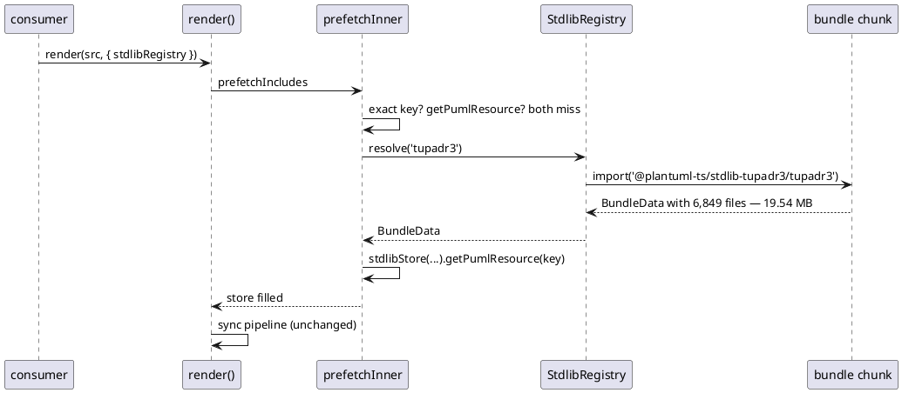
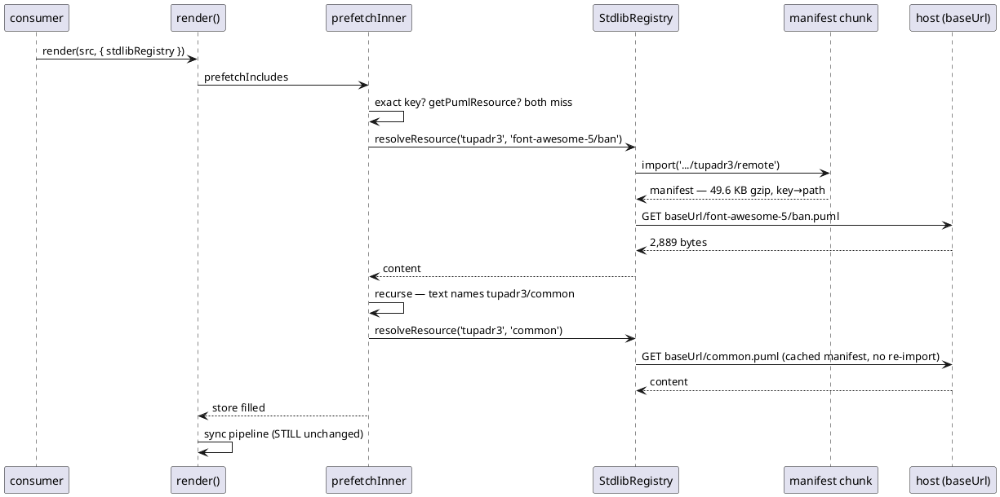

# Data flow — eager vs remote stdlib resolution

## Today (post-SI8): one bundle, one chunk



**19.54 MB to serve one 2.9 KB icon.**

## After SI11a: manifest chunk + per-resource fetch



The sync pipeline never changes. Everything SI11a does happens in the async
prefetch pass, which is the only place an `await` is available —
`renderSync` stays synchronous.

## The three resolution channels, in order

`prefetchInner`'s stdlib branch. SI8 established the order; SI11a changes only
what the third one does.

```plantuml
@startuml
skinparam componentStyle rectangle
skinparam shadowing false

[!include] as A
[exact key in store?] as B
[use it] as Z
[base.getPumlResource?] as C
[registry present?] as D
[StdlibNotBundledError] as E
[resolveResource(bundle, key)] as F
[files[key] — no network] as G
[key in manifest?] as H
[GET baseUrl + relPath] as I
[StdlibResourceFetchError] as J
[recurse into the resolved text] as K

A --> B
B --> Z : hit
B --> C : miss
C --> Z : hit
C --> D : miss
D --> E : no
D --> F : yes
F --> G : eager BundleData
F --> H : remote manifest
H --> E : no
H --> I : yes
I --> Z : ok
I --> J : reject
G --> Z
Z --> K
@enduml
```

Three failure modes, three different consumer actions — they must stay
distinguishable end to end:

| error | meaning | consumer does |
|---|---|---|
| `StdlibNotBundledError` | not registered, or not in this bundle | add a registration / fix the target |
| `StdlibChunkLoadError` | registered; the manifest chunk failed | fix bundler config |
| `StdlibResourceFetchError` | manifest fine; the resource fetch failed | fix `baseUrl` / host / CORS / CSP |
