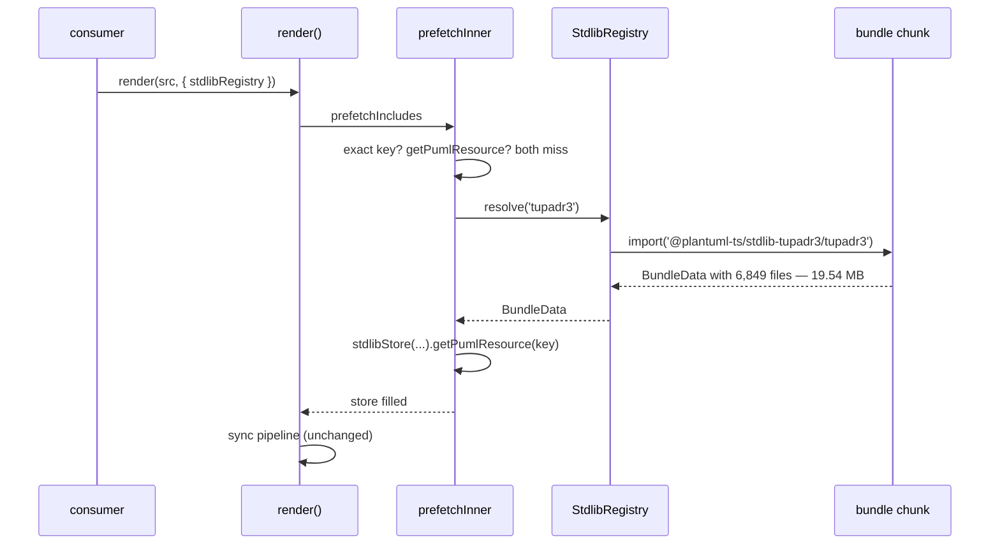
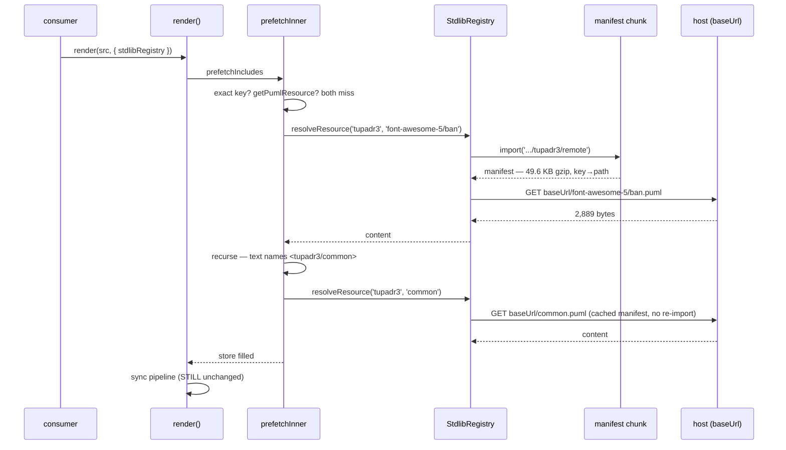
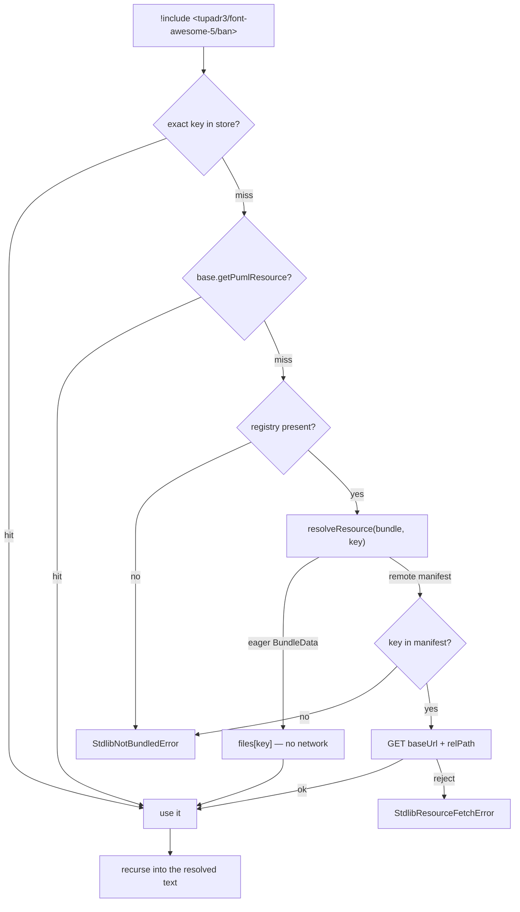

# Data flow — eager vs remote stdlib resolution

## Today (post-SI8): one bundle, one chunk

**19.54 MB to serve one 2.9 KB icon.**

## After SI11a: manifest chunk + per-resource fetch

The sync pipeline never changes. Everything SI11a does happens in the async
prefetch pass, which is the only place an `await` is available —
`renderSync` stays synchronous.

## The three resolution channels, in order

`prefetchInner`'s stdlib branch. SI8 established the order; SI11a changes only
what the third one does.

Three failure modes, three different consumer actions — they must stay
distinguishable end to end:

| error | meaning | consumer does |
|---|---|---|
| `StdlibNotBundledError` | not registered, or not in this bundle | add a registration / fix the target |
| `StdlibChunkLoadError` | registered; the manifest chunk failed | fix bundler config |
| `StdlibResourceFetchError` | manifest fine; the resource fetch failed | fix `baseUrl` / host / CORS / CSP |
