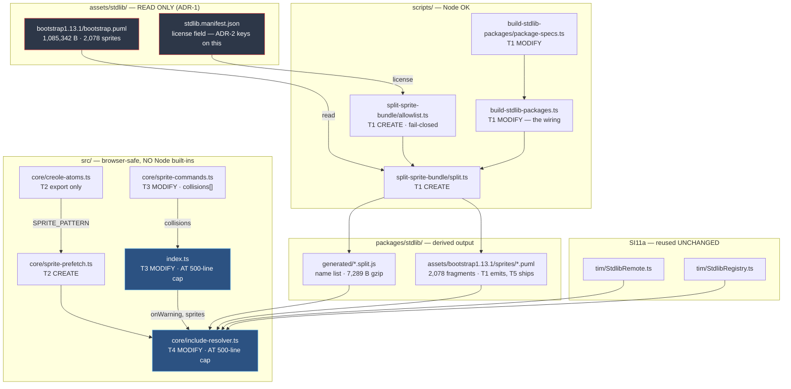

# Component map — what this mission touches

**Red** = read-only vendored input; writing there is stop condition 5.
**Blue** = files already AT the 500-line cap; budget lines before writing.

`StdlibRemote.ts` and `StdlibRegistry.ts` are consumed but **never modified** —
SI11a's surface is frozen (stop condition 4).

## Ownership, one writer per file

| File | Owner |
|---|---|
| `scripts/split-sprite-bundle/**`, `package-specs.ts`, `build-stdlib-packages.ts` | T1 |
| `src/core/sprite-prefetch.ts`, `src/core/creole-atoms.ts` | T2 |
| `src/core/sprite-commands.ts`, `src/index.ts` | T3 |
| `src/core/include-resolver.ts` | T4 |
| `packages/stdlib/**` | T5 |
| `tests/integration/sprite-split-e2e.test.ts` | T6 |
| `planning/mission-index.md`, this brief's `README.md` | T7 |

**`scripts/vendor-stdlib/**` has NO owner — by design.** ADR-1 removed the
need to touch it, and doing so is stop condition 5.
