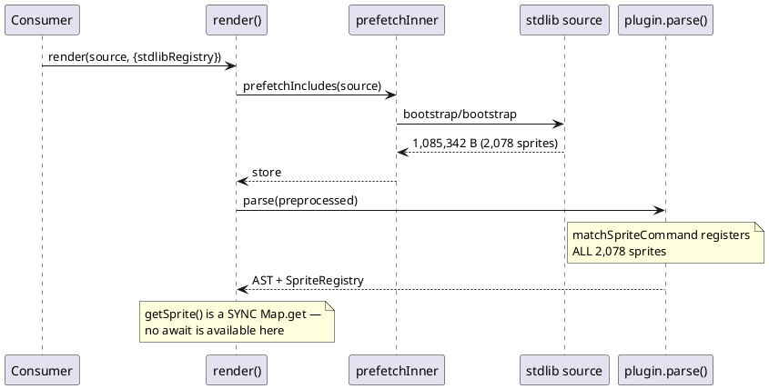
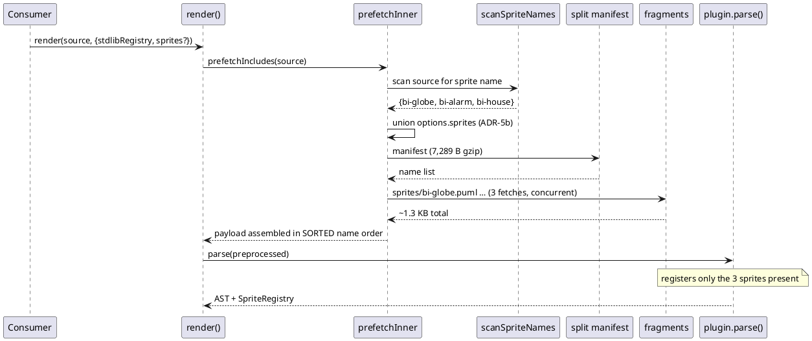
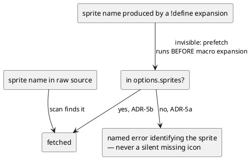

# Data flow — whole-file vs per-sprite

## Today: the whole file arrives through the include seam

## After: only the referenced sprites are fetched

**The lever is the include PAYLOAD, not the sprite registry.** Parsing is
untouched — it simply sees fewer `sprite` blocks, which is what keeps
`renderSync` synchronous (ADR-4).

## A name the scan cannot see

