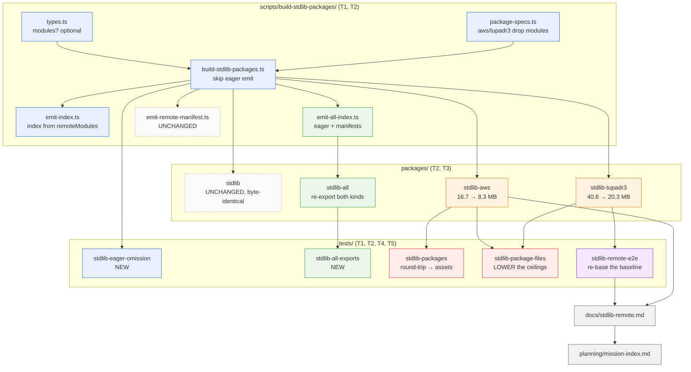

# Component map — what SI12 touches

```mermaid
graph TD
  subgraph gen["scripts/build-stdlib-packages/ (T1, T2)"]
    types["types.ts<br/>modules? optional"]:::t1
    specs["package-specs.ts<br/>aws/tupadr3 drop modules"]:::t1
    build["build-stdlib-packages.ts<br/>skip eager emit"]:::t1
    idx["emit-index.ts<br/>index from remoteModules"]:::t1
    allidx["emit-all-index.ts<br/>eager + manifests"]:::t2
    remote["emit-remote-manifest.ts<br/>UNCHANGED"]:::keep
  end

  subgraph pkgs["packages/ (T2, T3)"]
    pstd["stdlib<br/>UNCHANGED, byte-identical"]:::keep
    paws["stdlib-aws<br/>16.7 → 8.3 MB"]:::t3
    ptup["stdlib-tupadr3<br/>40.8 → 20.3 MB"]:::t3
    pall["stdlib-all<br/>re-export both kinds"]:::t2
  end

  subgraph tests["tests/ (T1, T2, T4, T5)"]
    tomit["stdlib-eager-omission<br/>NEW"]:::t1
    tall["stdlib-all-exports<br/>NEW"]:::t2
    tpkg["stdlib-packages<br/>round-trip → assets"]:::t4
    tfiles["stdlib-package-files<br/>LOWER the ceilings"]:::t4
    te2e["stdlib-remote-e2e<br/>re-base the baseline"]:::t5
  end

  docs["docs/stdlib-remote.md"]:::t6
  index["planning/mission-index.md"]:::t7

  types --> build
  specs --> build
  build --> idx
  build --> remote
  build --> allidx
  build --> paws
  build --> ptup
  build --> pstd
  allidx --> pall
  paws --> tfiles
  ptup --> tfiles
  ptup --> te2e
  paws --> tpkg
  pall --> tall
  build --> tomit
  te2e --> docs
  paws --> docs
  docs --> index

  classDef t1 fill:#e8f0ff,stroke:#3366cc
  classDef t2 fill:#eaf7ea,stroke:#339933
  classDef t3 fill:#fff3e0,stroke:#cc7a00
  classDef t4 fill:#fdeaea,stroke:#cc3333
  classDef t5 fill:#f3e8ff,stroke:#8833cc
  classDef t6 fill:#f0f0f0,stroke:#666
  classDef t7 fill:#f0f0f0,stroke:#666
  classDef keep fill:#fafafa,stroke:#bbb,stroke-dasharray: 4 3
```

`assets/` is emitted unchanged for all three packages — it is what the CDN
recipe and SI11b's per-sprite loading resolve against (stop condition 5).
