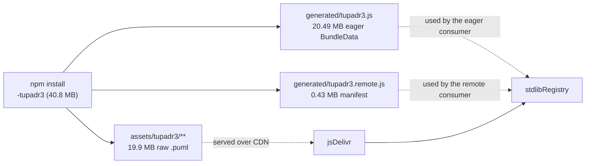
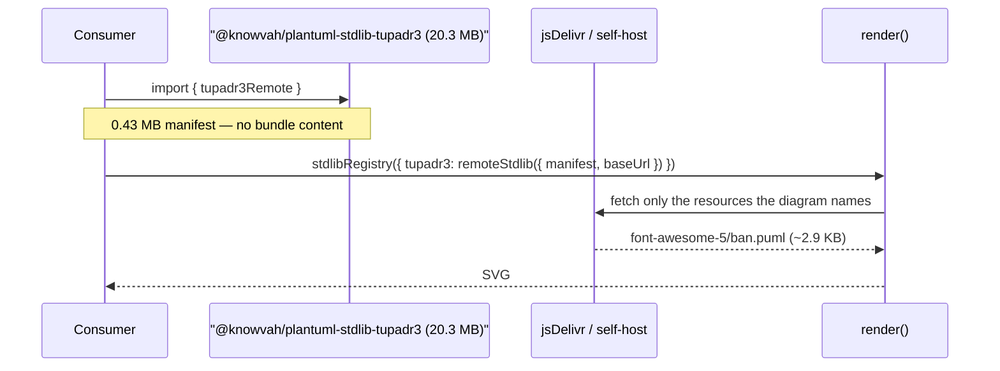
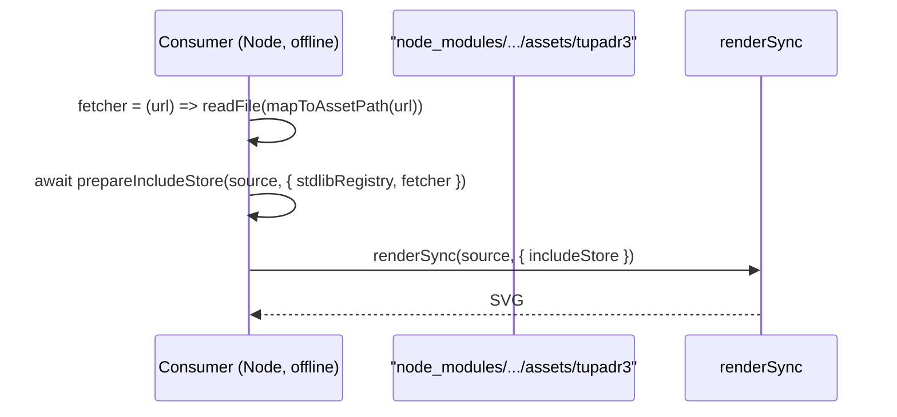

# Data flow — how a consumer registers a bundle, before and after

## Before: two encodings shipped, one used

Every consumer downloads all three; each uses at most two.

## After: one encoding per package

## Offline, without an eager module

The eager module was never the only offline path — this recipe already works
today and is what replaces it (T6 documents it end to end).
