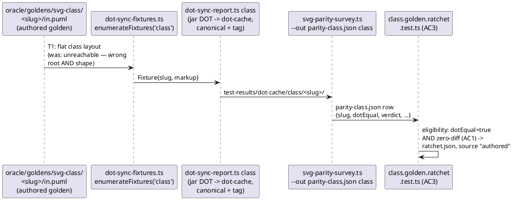

# SI13 registration chain

```plantuml
@startuml
participant "oracle/goldens/svg-class/\n<slug>/in.puml\n(authored golden)" as G
participant "dot-sync-fixtures.ts\nenumerateFixtures('class')" as E
participant "dot-sync-report.ts class\n(jar DOT -> dot-cache,\ncanonical + tag)" as R
participant "svg-parity-survey.ts\n--out parity-class.json class" as S
participant "class.golden.ratchet\n.test.ts (AC3)" as T

G -> E : T1: flat class layout\n(was: unreachable — wrong\nroot AND shape)
E -> R : Fixture{slug, markup}
R -> S : test-results/dot-cache/class/<slug>/
S -> T : parity-class.json row\n{slug, dotEqual, verdict, ...}
T -> T : eligibility: dotEqual=true\nAND zero-diff (AC1) ->\nratchet.json, source "authored"
@enduml
```

The break was at the first edge; everything downstream already handles
class (TYPE_TAGS `class: 'CLASS'`, survey `--out`, ratchet AC3).
