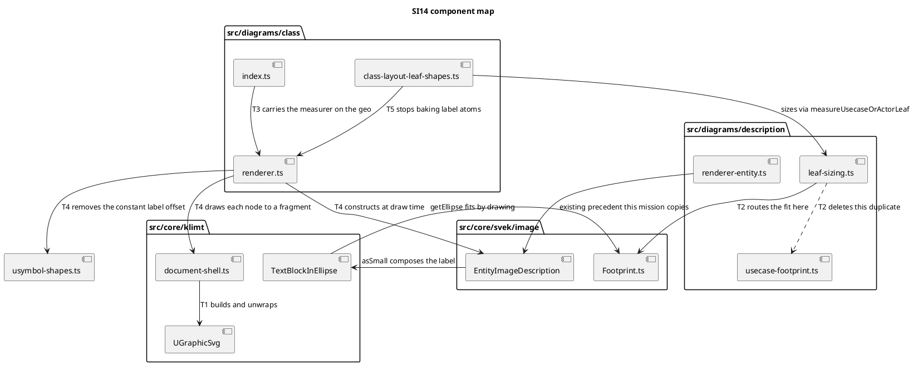

# Component map — what SI14 touches

Component diagram: the question is *which logical parts talk to what*, not where
anything runs.

## Reading it

Three of these edges are the mission:

- `CI --> CR` (T3) gives the renderer something to measure with.
- `CR --> EID` (T4) makes the renderer construct the object rather than
  reconstruct its output.
- `LS ..> UFP` (T2) is the dashed one — the second, data-based copy of the fit
  goes away, and `LS --> FP` replaces it with the object-based one.

`RE --> EID` is drawn because it is the working precedent: the description
engine has done this since G1, and the class engine is the only holdout.
