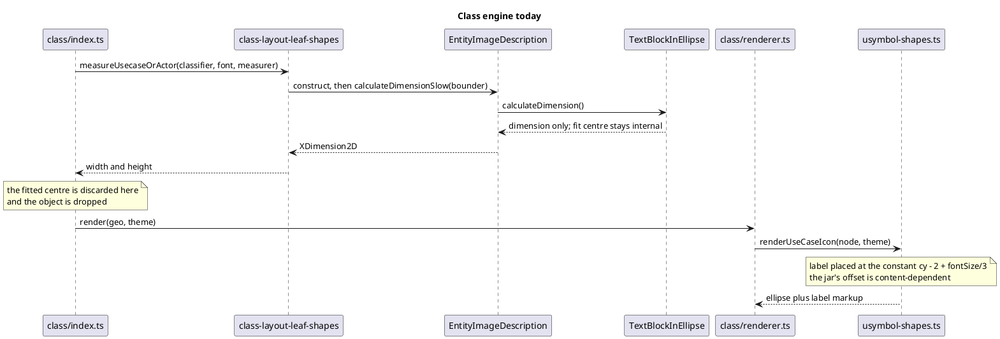
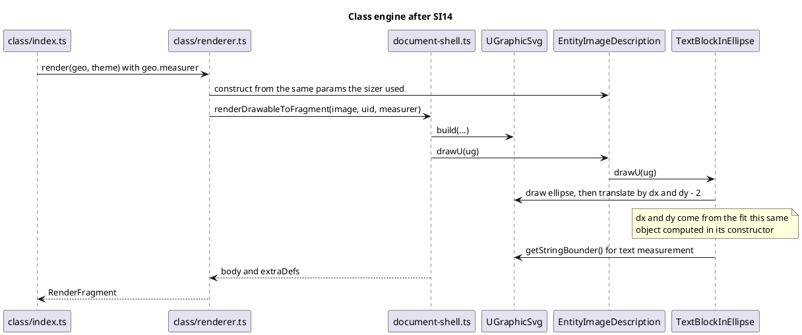

# Data flow — measurement, before and after

Sequence diagrams: the question is *who calls whom, in what order*, across
several participants.

## Today — the faithful object is used as a calculator, then discarded

## After SI14 — the object draws itself, as upstream does

## Why the second diagram has no "pass the centre" arrow

That is the point of the mission. Upstream shares the **object**
(`IEntityImage extends TextBlock`, fit computed once in the constructor) and the
**measurer** (`ug.getStringBounder()`). No coordinate crosses a boundary. If an
implementation finds itself adding an arrow carrying a number from the sizer to
the renderer, it has taken the wrong approach — see `../decisions.md`.
