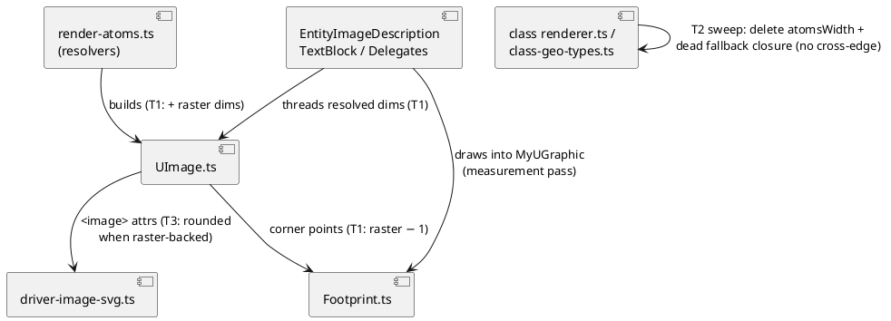

# SI15 component map

```plantuml
@startuml
component [render-atoms.ts\n(resolvers)] as RA
component [UImage.ts] as U
component [Footprint.ts] as F
component [EntityImageDescription\nTextBlock / Delegates] as E
component [driver-image-svg.ts] as D
component [class renderer.ts /\nclass-geo-types.ts] as C

RA --> U : builds (T1: + raster dims)
E --> U : threads resolved dims (T1)
E --> F : draws into MyUGraphic\n(measurement pass)
U --> F : corner points (T1: raster − 1)
U --> D : <image> attrs (T3: rounded\nwhen raster-backed)
C --> C : T2 sweep: delete atomsWidth +\ndead fallback closure (no cross-edge)
@enduml
```

T2's node is deliberately isolated — the sweep must not change any edge in
this graph.
