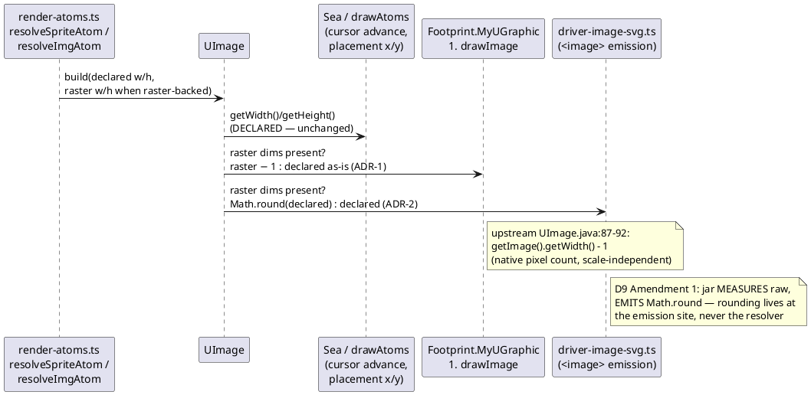

# SI15 data flow — the two-notion split

The one diagram that matters: where declared dims flow vs where raster dims
flow after T1/T3. The bug was that the left-hand consumers received the
right-hand column's number.

Raster sources: monochrome sprite → native grid dims (PNG raster is one
pixel per grid cell); `` atom → IHDR dims (`creole-atoms.ts:358`).
Rasterless (latex/KaTeX, SVG sprites via `drawPath`): both consumers keep
today's behaviour bit-for-bit.
