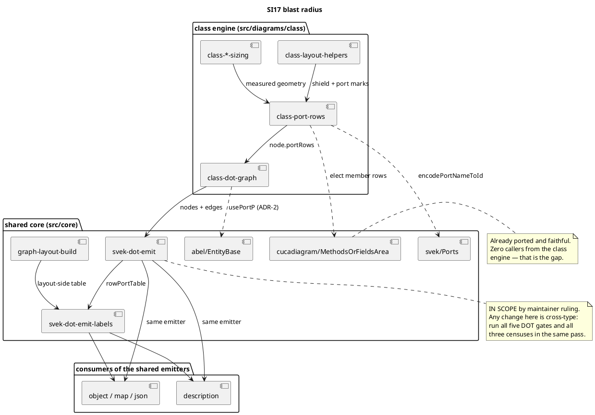

# Component map — what SI17 touches

Component diagram: the question is *what talks to what* (logical
structure), not where anything runs.

## Ownership, for parallel safety

| Component | Written by |
|---|---|
| `class-port-rows` | T1, then T2 — **sequential, one writer at a time** |
| `class-layout-helpers` | T2 only |
| `class-dot-graph` | T2 only |
| `svek-dot-emit` / `-labels` | T2 only, and only if genuinely required |
| `MethodsOrFieldsArea`, `Ports`, `EntityBase` | **read-only** — already faithful |
