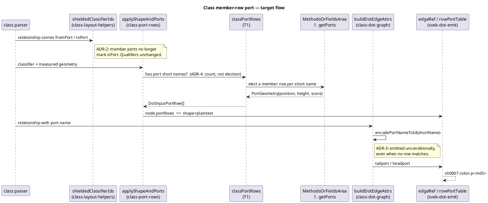
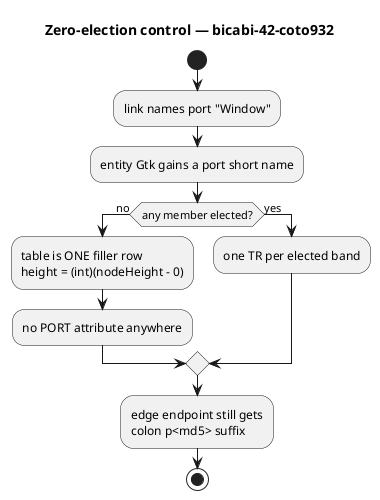

# Data flow — how a `A::member` edge acquires its port

Sequence: *who* calls whom matters here (several components exchange the
port name and its md5), so this is a sequence diagram rather than an
activity one.

## Target flow (what T2 builds)

## The dangling-port case (`bicabi-42`, jar-proven)

The node declares **no** port row, and the edge still carries the suffix.
This is upstream behavior, not a bug to guard against — see
[ADR-3](../decisions.md).

