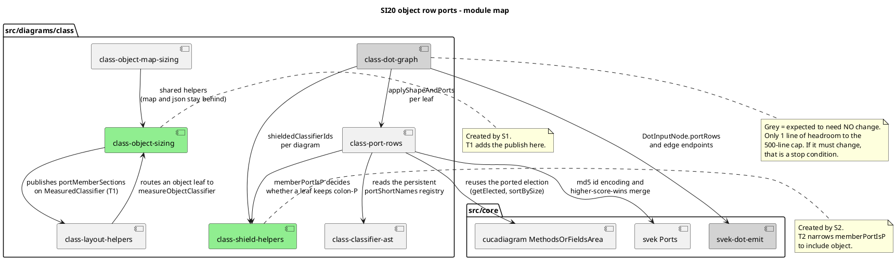

# Component map — si20-object-row-ports

Which modules this mission touches, and how they relate. Two are **created**
by the split tasks (S1, S2); one is deliberately **not touched** despite
sitting on the path.

## Reading it

- **Green** — new files created by the up-front split tasks (ADR-7).
- **Grey** — on the path but expected to be untouched. `svek-dot-emit` was
  already fixed by SI17's B1 (`:h` gated on the qualifier test rather than on
  shape), so an object node that gains `portRows` takes the correct branch
  with no further change. `class-dot-graph` needs no change because
  `classPortShortNamesById` returning a larger map requires no signature
  change in its callers.
- `map` and `json` continue to reach `class-object-map-sizing` and are out of
  scope entirely (ADR-4).
