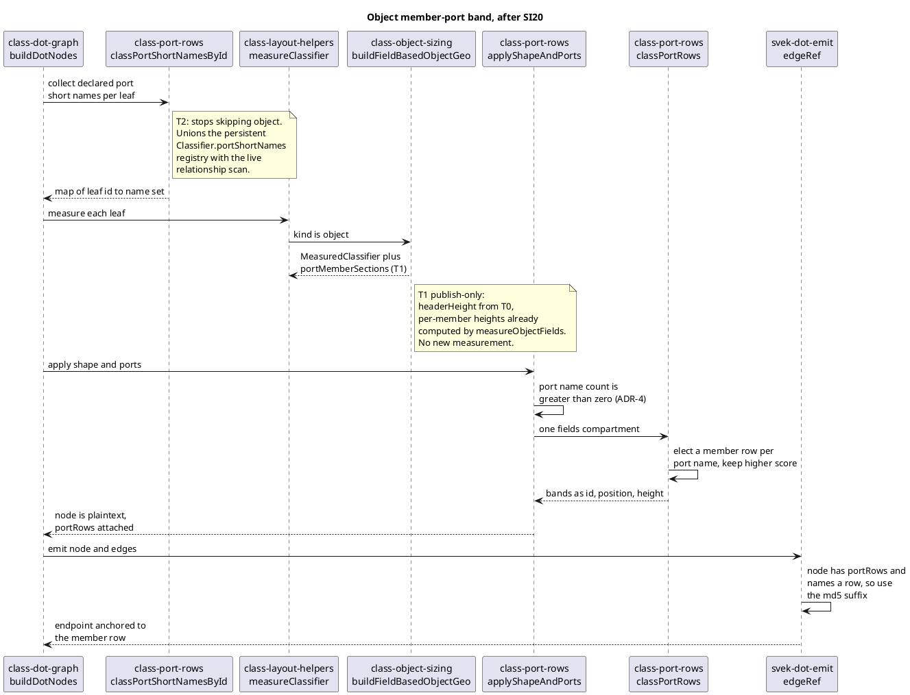

# Data flow — si20-object-row-ports

How an object leaf carrying a member port reaches the emitted DOT, after this
mission lands. The fixture is `rozuxo-44-fudi093`, whose source is two object
leaves joined by an edge naming a member on each end.

## What changes versus today

Today the object leaf never reaches `classPortRows` at all:
`classPortShortNamesById` filters it out, so `applyShapeAndPorts` attaches no
bands, `memberPortIsP` leaves the leaf marked for the PORTIN/PORTOUT shield,
and `edgeRef` emits the compass suffix against a shield table. The oracle
instead anchors each endpoint to that member's own row.

## The one branch worth reading twice

`edgeRef`'s precedence, post-SI17-B1, tests `isPort` **before** `portRows`.
That is why T2 must retire the `:P` marking for objects in the *same* commit
that attaches the bands — a leaf still carrying `isPort` keeps winning the
compass suffix no matter what bands hang off it.
