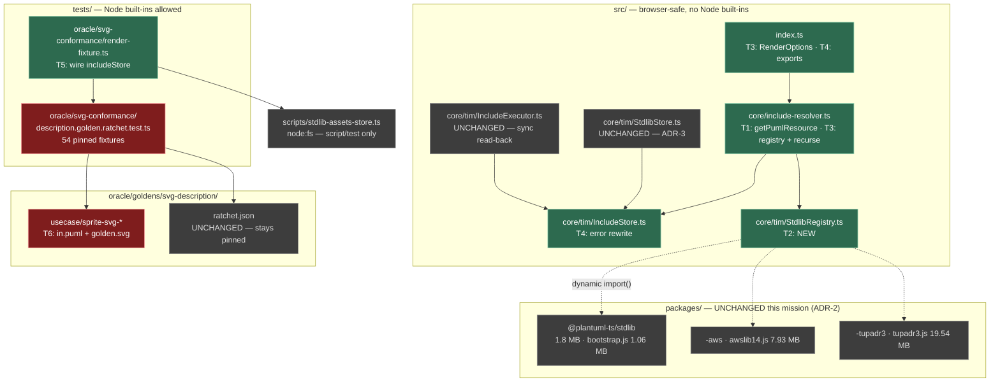

# Component map — what this mission touches

**Green** — modified or created. **Red** — the ratchet gate this mission can
break (T6). **Grey** — deliberately untouched.

## The boundary that must not blur

`src/` may not import Node built-ins; `tests/` and `scripts/` may. T2 builds a
browser-safe registry in `src/`; T5 wires a `node:fs`-backed assets store into a
test harness. Both are correct, for different reasons. A Node import reaching
`src/` is stop condition 1.

## Why `packages/` is untouched

Per-bundle laziness needs no change to the generated artifacts — the existing
per-bundle subpath exports (`@plantuml-ts/stdlib/bootstrap`) are exactly what a
dynamic-`import()` thunk targets. Changing the generated shape is the deferred
per-resource mission ([ADR-2](../decisions.md#adr-2)).
