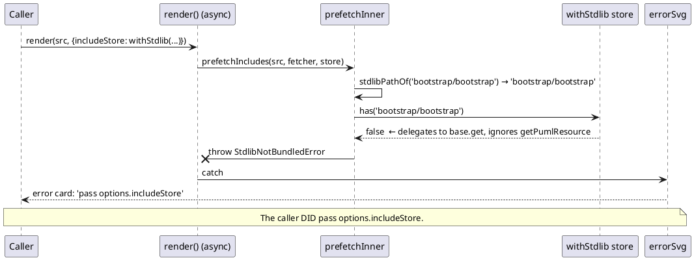
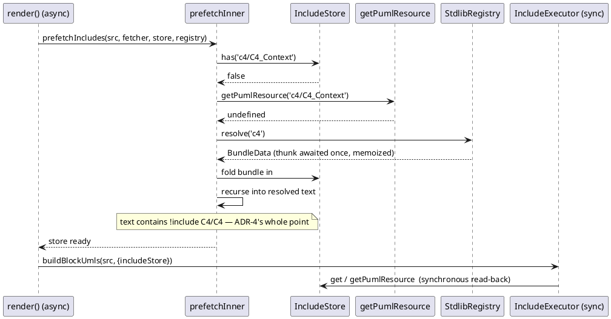
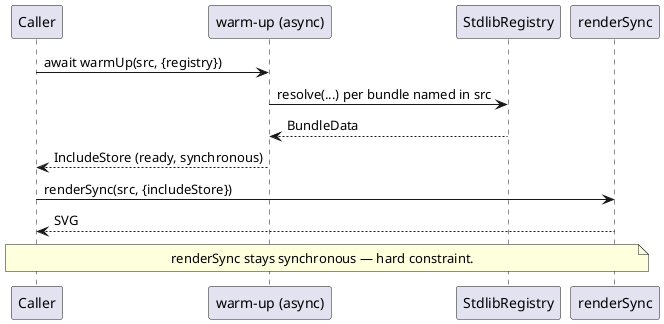

# Data flow — the include seam, sync vs async

## Today (the defect T1 fixes)

`prefetchInner` asks the store for an **exact key**. A `withStdlib` store answers
through `getPumlResource`, which is never consulted — so the async path fails on
input the sync path handles.

`renderSync` never runs the prefetch pass, which is the only reason stdlib works
there — and why ten `withStdlib` call sites never caught this.

## After T1 + T3

Exact key still wins first; `getPumlResource` is consulted on the miss; the
registry is consulted after that; resolved bundle text **re-enters the walk**
because bundle files include each other.

## `renderSync` — ADR-5's warm-up

The sync interpreter cannot await, so the caller performs the async half
explicitly. This is the same two steps `render()` already does internally.

