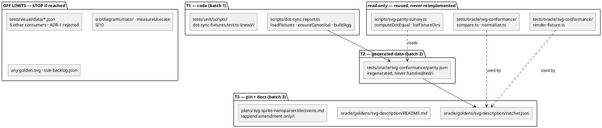

# Component map — what this mission touches

## Blast radius by layer

| Layer | Effect |
|---|---|
| Data model | No schema change. `parity.json` regenerates (355 → 358 rows, all re-measured); `ratchet.json` gains 3. `test-results/` is gitignored and rebuildable. |
| API contracts | **None.** Nothing under `src/` changes; `src/index.ts` untouched. No semver implication. |
| Service deps | Pinned oracle jar + java 21, both present. Failure mode unchanged: no jar → no cache → survey sees nothing. |
| Files | 1 script, 1 new test, 2 generated/data files, 2 docs. |

## Why `tests/visual/data/*.json` is off limits

Six consumers read it — `scripts/capture-corpus.ts`,
`scripts/build-pages.ts`, `scripts/classify-corpus.ts`, and four integration
tests. ADR-1's rejected option would push three new fixtures into all of
them, including the demo page builder. Changing only
`dot-sync-report.ts`'s private reader keeps every one of them untouched.

This containment was discovered at trace level two and is now the strongest
argument for the chosen approach.
