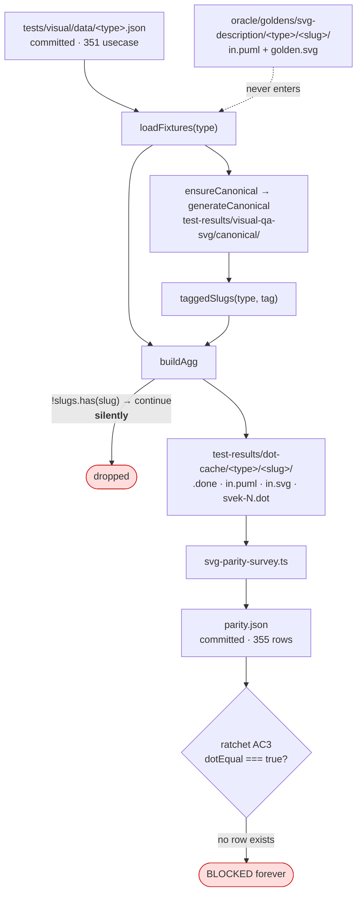
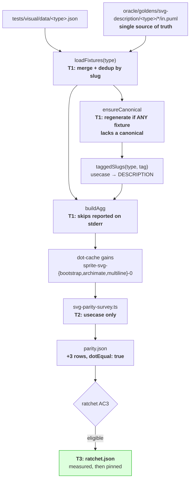
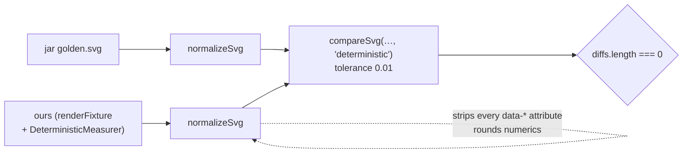

# Data flow — the registration chain

## Today: authored fixtures cannot reach the ratchet

Two independent failures, and the second is the reason this mission is not a
one-line change:

1. **`loadFixtures` never sees authored fixtures** — no cache entry, no
   parity row, AC3 blocks them permanently.
2. **Even once enumerated, `buildAgg` drops them silently** — they have no
   canonical SVG, so `taggedSlugs` omits them, so
   `if (!slugs.has(f.slug)) continue` discards them with no output at all.

## After: enumeration plus per-slug canonical freshness

## The measurement contract — read this before comparing anything

The ratchet does **not** compare raw bytes.

Measuring with `===` reports differences the gate does not care about —
`data-source-line`, 4th-decimal coordinates — and invents blockers that do
not exist. This cost the predecessor mission real time. Always
`compareSvg(ours, jar, 'deterministic')`.
