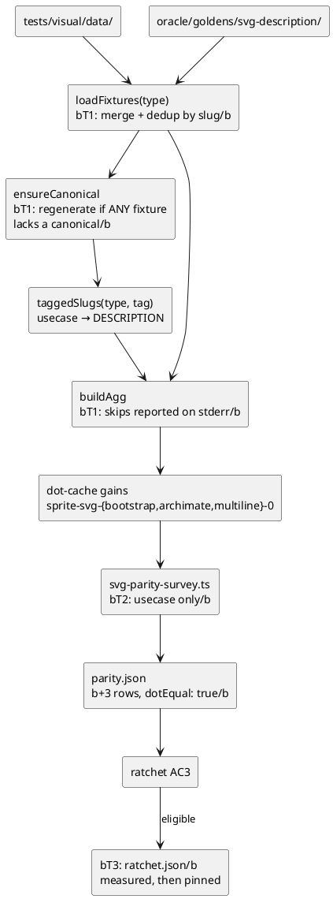
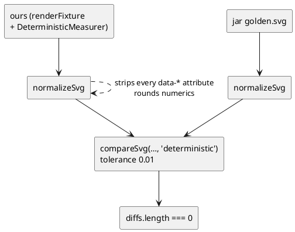

# Data flow — the registration chain

## Today: authored fixtures cannot reach the ratchet

```plantuml
@startuml
skinparam componentStyle rectangle
skinparam shadowing false

[tests/visual/data/] as M
[loadFixtures(type)] as LF
[oracle/goldens/svg-description/type/slug/\nin.puml + golden.svg] as A
[ensureCanonical → generateCanonical\ntest-results/visual-qa-svg/canonical/] as CAN
[taggedSlugs(type, tag)] as TAG
[buildAgg] as BA
[['dropped']] as DROP
[test-results/dot-cache/] as CACHE
[svg-parity-survey.ts] as SUR
[parity.json\ncommitted · 355 rows] as PJ
[ratchet AC3\ndotEqual === true?] as AC3
[['BLOCKED forever']] as BLOCK

M --> LF
A ..> LF : never enters
LF --> CAN
CAN --> TAG
LF --> BA
TAG --> BA
BA --> DROP : !slugs.has(slug) → continue\nbsilently/b
BA --> CACHE
CACHE --> SUR
SUR --> PJ
PJ --> AC3
AC3 --> BLOCK : no row exists
@enduml
```

Two independent failures, and the second is the reason this mission is not a
one-line change:

1. **`loadFixtures` never sees authored fixtures** — no cache entry, no
   parity row, AC3 blocks them permanently.
2. **Even once enumerated, `buildAgg` drops them silently** — they have no
   canonical SVG, so `taggedSlugs` omits them, so
   `if (!slugs.has(f.slug)) continue` discards them with no output at all.

## After: enumeration plus per-slug canonical freshness



## The measurement contract — read this before comparing anything

The ratchet does **not** compare raw bytes.



Measuring with `===` reports differences the gate does not care about —
`data-source-line`, 4th-decimal coordinates — and invents blockers that do
not exist. This cost the predecessor mission real time. Always
`compareSvg(ours, jar, 'deterministic')`.
