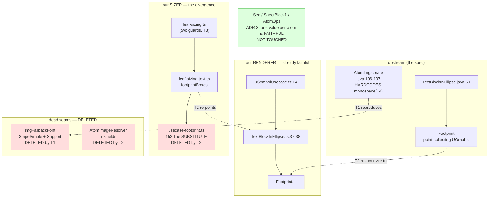

# Component map

What this mission touches, and the sizer↔renderer split it closes.

**The shape of the bug:** the renderer already reaches upstream's real
`Footprint`; the sizer runs a parallel analytic substitute. Everything red
above exists only to feed that substitute. Delete it and the seams have no
reason to exist.
