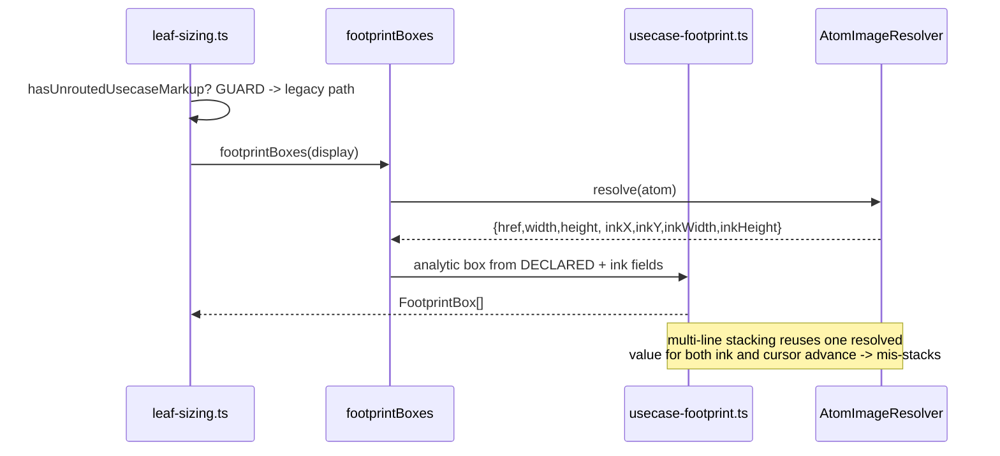
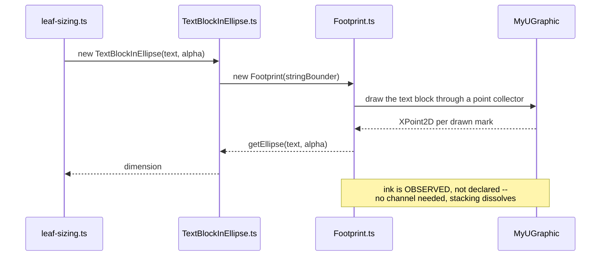

# Data flow — before and after

## Before: the sizer is told the ink

## After: the sizer observes the ink

The renderer already runs the second flow (`USymbolUsecase.ts` →
`TextBlockInEllipse.ts`). This mission makes the sizer run it too.
