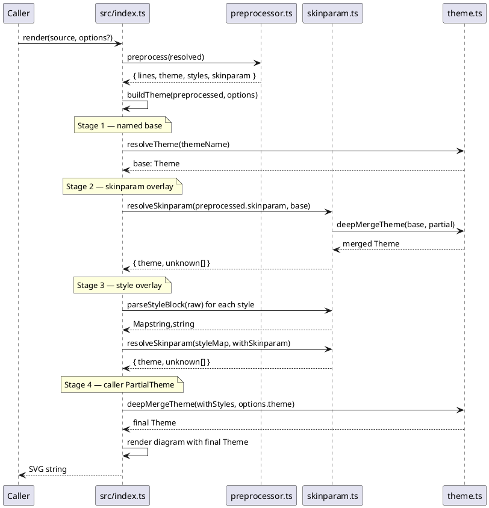

# Data Flow — Skinparam Pipeline

```plantuml
@startuml
participant Caller
participant "src/index.ts" as index
participant "preprocessor.ts" as preprocessor
participant "skinparam.ts" as skinparam
participant "theme.ts" as theme
Caller -> index : render(source, options?)
index -> preprocessor : preprocess(resolved)
preprocessor --> index : { lines, theme, styles, skinparam }
index -> index : buildTheme(preprocessed, options)
note over index : Stage 1 — named base
index -> theme : resolveTheme(themeName)
theme --> index : base: Theme
note over index : Stage 2 — skinparam overlay
index -> skinparam : resolveSkinparam(preprocessed.skinparam, base)
skinparam -> theme : deepMergeTheme(base, partial)
theme --> skinparam : merged Theme
skinparam --> index : { theme, unknown[] }
note over index : Stage 3 — style overlay
index -> skinparam : parseStyleBlock(raw) for each style
skinparam --> index : Mapstring,string
index -> skinparam : resolveSkinparam(styleMap, withSkinparam)
skinparam --> index : { theme, unknown[] }
note over index : Stage 4 — caller PartialTheme
index -> theme : deepMergeTheme(withStyles, options.theme)
theme --> index : final Theme
index -> index : render diagram with final Theme
index --> Caller : SVG string
@enduml
```
