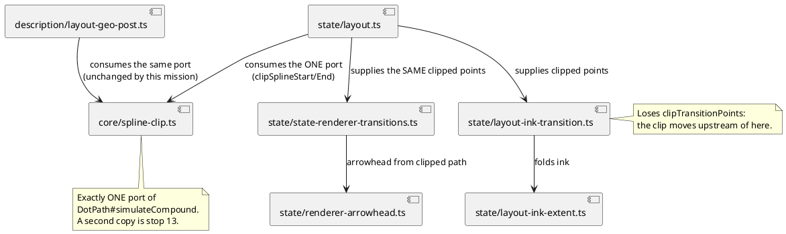

# Component map — what this mission touches

```plantuml
@startuml
component [core/spline-clip.ts] as CLIP
component [state/layout.ts] as LAYOUT
component [state/layout-ink-transition.ts] as INK
component [state/layout-ink-extent.ts] as EXTENT
component [state/renderer-arrowhead.ts] as ARROW
component [state/state-renderer-transitions.ts] as DRAW
component [description/layout-geo-post.ts] as DESC

LAYOUT --> CLIP : consumes the ONE port\n(clipSplineStart/End)
DESC --> CLIP : consumes the same port\n(unchanged by this mission)
LAYOUT --> INK : supplies clipped points
INK --> EXTENT : folds ink
LAYOUT --> DRAW : supplies the SAME clipped points
DRAW --> ARROW : arrowhead from clipped path

note bottom of CLIP
  Exactly ONE port of
  DotPath#simulateCompound.
  A second copy is stop 13.
end note

note right of INK
  Loses clipTransitionPoints:
  the clip moves upstream of here.
end note
@enduml
```
