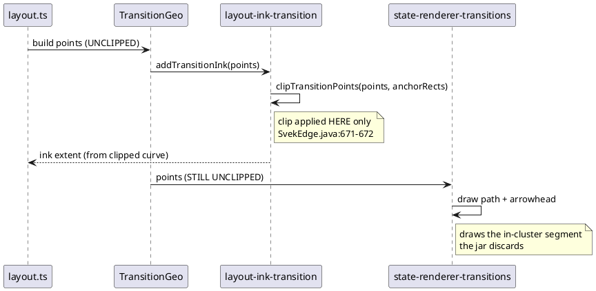
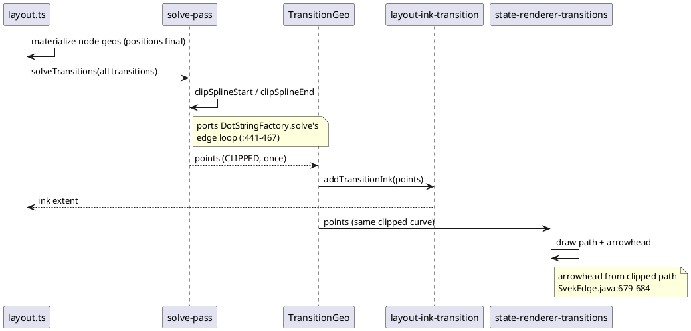

# Data flow — where the clip runs, before and after

## Today (the divergence)

The clip runs inside the ink walk only, so the renderer reads a different
curve from the one that was measured.

## After (upstream's shape)

One pass clips every transition after node geometry is final; both consumers
read the same clipped curve.

