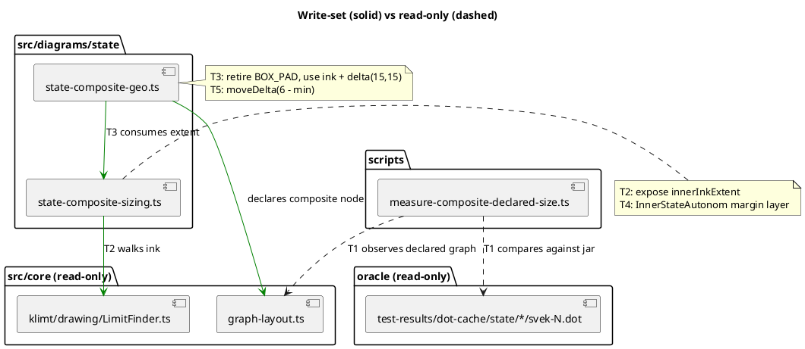

# What this mission touches

Write-sets are disjoint per task. `LimitFinder` and the outer graph-layout
seam are READ, never written — decision D5 makes a write there a stop.

## Ownership

| File | Owner | Batch |
|---|---|---|
| `scripts/measure-composite-declared-size.ts` | T1 | 1 |
| `src/diagrams/state/state-composite-sizing.ts` | T2, then T4 | 1, 2 |
| `src/diagrams/state/state-composite-geo.ts` | T3, then T5 | 2, 3 |

No two tasks in the same batch share a file. T2/T4 and T3/T5 share one each
across batches, which is why Batch 2 is serial.
