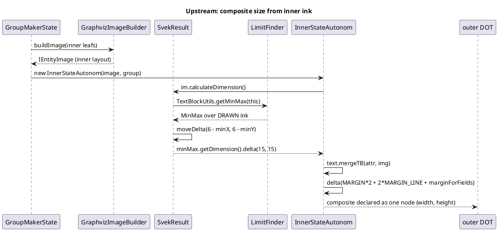
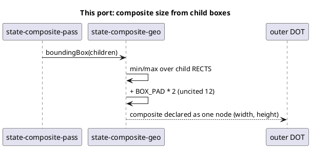

# How a composite's declared size is derived

Upstream's order of operations, which this mission ports. The shift happens
*between* the ink walk and the returned dimension — that ordering is why
decision D2 keeps both halves in one mission.

## What this port does today

Two divergences, stacked: boxes measured where jar measures ink, and a
`+24` where upstream layers `delta(15,15)` then a 20/25 margin. Neither is
visible to the standing gates — hence T1's declared-size harness.
