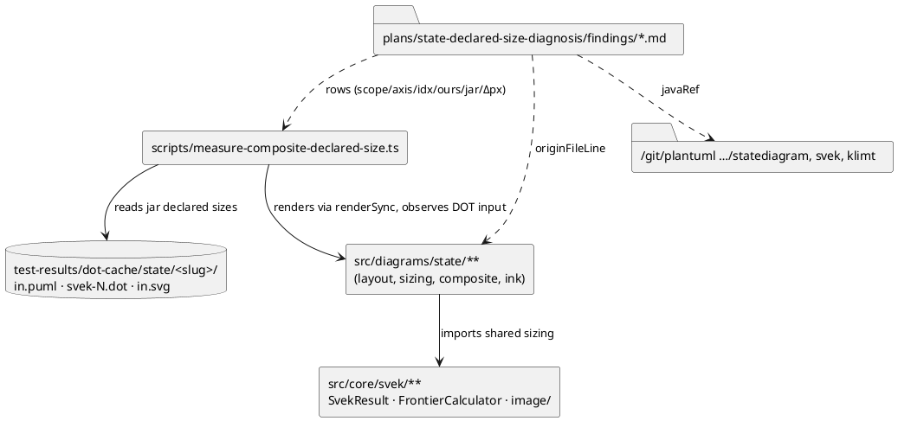

# Component map — what the diagnosis reads

```plantuml
@startuml
skinparam componentStyle rectangle
component [scripts/measure-composite-declared-size.ts] as H
database "test-results/dot-cache/state/<slug>/\nin.puml · svek-N.dot · in.svg" as C
component [src/diagrams/state/**\n(layout, sizing, composite, ink)] as S
component [src/core/svek/**\nSvekResult · FrontierCalculator · image/] as K
folder "~/git/plantuml …/statediagram, svek, klimt" as J
folder "plans/state-declared-size-diagnosis/findings/*.md" as F
H --> C : reads jar declared sizes
H --> S : renders via renderSync, observes DOT input
S --> K : imports shared sizing
F ..> H : rows (scope/axis/idx/ours/jar/Δpx)
F ..> S : originFileLine
F ..> J : javaRef
@enduml
```
