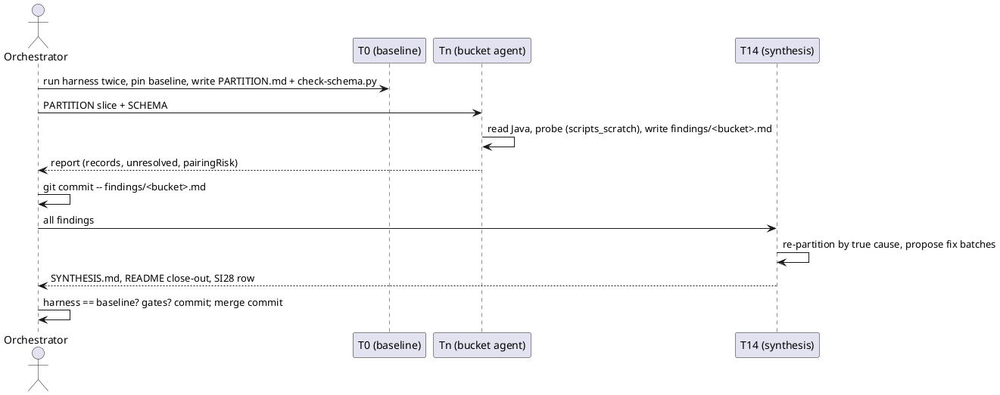

# Data flow — one bucket task

```plantuml
@startuml
actor Orchestrator as O
participant "T0 (baseline)" as T0
participant "Tn (bucket agent)" as Tn
participant "T14 (synthesis)" as T14
O -> T0 : run harness twice, pin baseline, write PARTITION.md + check-schema.py
O -> Tn : PARTITION slice + SCHEMA
Tn -> Tn : read Java, probe (scripts_scratch), write findings/<bucket>.md
Tn --> O : report (records, unresolved, pairingRisk)
O -> O : git commit -- findings/<bucket>.md
O -> T14 : all findings
T14 -> T14 : re-partition by true cause, propose fix batches
T14 --> O : SYNTHESIS.md, README close-out, SI28 row
O -> O : harness == baseline? gates? commit; merge commit
@enduml
```
