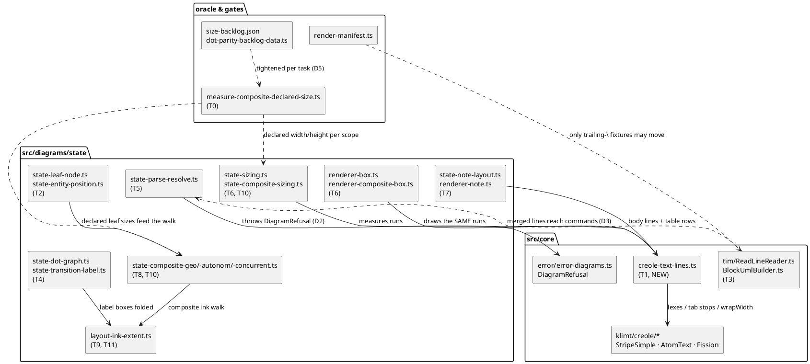

# Component map — what SI29 touches

```plantuml
@startuml
skinparam componentStyle rectangle
package "src/core" {
  [creole-text-lines.ts\n(T1, NEW)] as seam
  [klimt/creole/*\nStripeSimple · AtomText · Fission] as klimt
  [tim/ReadLineReader.ts\nBlockUmlBuilder.ts\n(T3)] as reader
  [error/error-diagrams.ts\nDiagramRefusal] as err
}
package "src/diagrams/state" {
  [state-parse-resolve.ts\n(T5)] as parse
  [state-sizing.ts\nstate-composite-sizing.ts\n(T6, T10)] as sizing
  [renderer-box.ts\nrenderer-composite-box.ts\n(T6)] as render
  [state-note-layout.ts\nrenderer-note.ts\n(T7)] as note
  [state-leaf-node.ts\nstate-entity-position.ts\n(T2)] as leaf
  [state-dot-graph.ts\nstate-transition-label.ts\n(T4)] as dot
  [state-composite-geo/-autonom/-concurrent.ts\n(T8, T10)] as geo
  [layout-ink-extent.ts\n(T9, T11)] as ink
}
package "oracle & gates" {
  [measure-composite-declared-size.ts\n(T0)] as harness
  [size-backlog.json\ndot-parity-backlog-data.ts] as ratchet
  [render-manifest.ts] as manifest
}
seam --> klimt : lexes / tab stops / wrapWidth
sizing --> seam : measures runs
render --> seam : draws the SAME runs
note --> seam : body lines + table rows
parse --> err : throws DiagramRefusal (D2)
reader ..> parse : merged lines reach commands (D3)
geo --> ink : composite ink walk
leaf --> geo : declared leaf sizes feed the walk
dot --> ink : label boxes folded
harness ..> sizing : declared width/height per scope
harness ..> geo
ratchet ..> harness : tightened per task (D5)
manifest ..> reader : only trailing-\\ fixtures may move
@enduml
```
