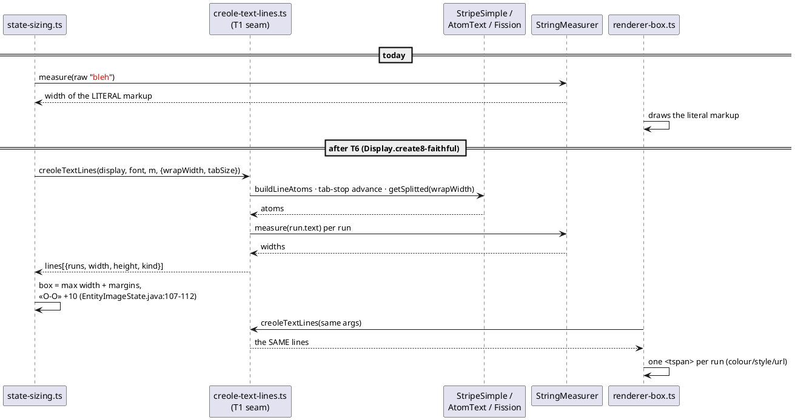
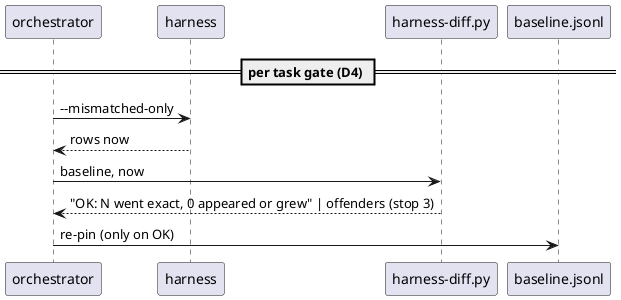

# Data flow — one state text line, before and after T1/T6

```plantuml
@startuml
participant "state-sizing.ts" as S
participant "creole-text-lines.ts\n(T1 seam)" as C
participant "StripeSimple /\nAtomText / Fission" as K
participant "StringMeasurer" as M
participant "renderer-box.ts" as R
== today ==
S -> M : measure(raw "<color:red>bleh</color>")
M --> S : width of the LITERAL markup
R -> R : draws the literal markup
== after T6 (Display.create8-faithful) ==
S -> C : creoleTextLines(display, font, m, {wrapWidth, tabSize})
C -> K : buildLineAtoms · tab-stop advance · getSplitted(wrapWidth)
K --> C : atoms
C -> M : measure(run.text) per run
M --> C : widths
C --> S : lines[{runs, width, height, kind}]
S -> S : box = max width + margins,\n<<O-O>> +10 (EntityImageState.java:107-112)
R -> C : creoleTextLines(same args)
C --> R : the SAME lines
R -> R : one <tspan> per run (colour/style/url)
@enduml
```

```plantuml
@startuml
participant "orchestrator" as O
participant "harness" as H
participant "harness-diff.py" as D
participant "baseline.jsonl" as B
== per task gate (D4) ==
O -> H : --mismatched-only
H --> O : rows now
O -> D : baseline, now
D --> O : "OK: N went exact, 0 appeared or grew" | offenders (stop 3)
O -> B : re-pin (only on OK)
@enduml
```
