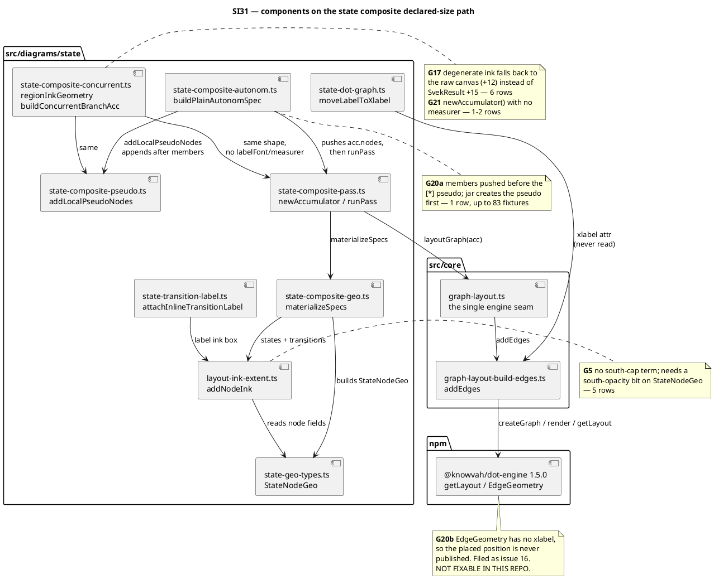

# Component map — what this mission touches

Component diagram: the declared-size path for a state composite, with each
group's defect marked at the component that owns it. G20b is drawn outside the
repo boundary because its fix is not ours to make.

