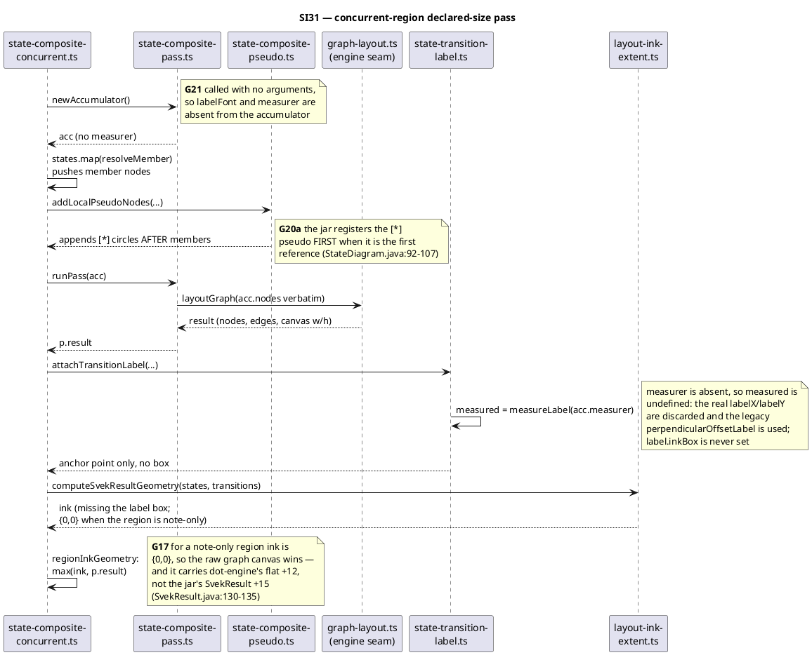

# Data flow — where each defect fires

Sequence diagram: one concurrent-region sizing pass, the flow that carries
G17, G21 and G20a. Participants are modules, and each `x` marks where the
current code diverges from the jar.

## Reading it

All three defects are on one pass, which is why the batches are serial: each
changes an input the next one reads. G21 restores the label box that G17's
`Math.max` then compares against, and G20a changes the node order that
produces `p.result` in the first place.
