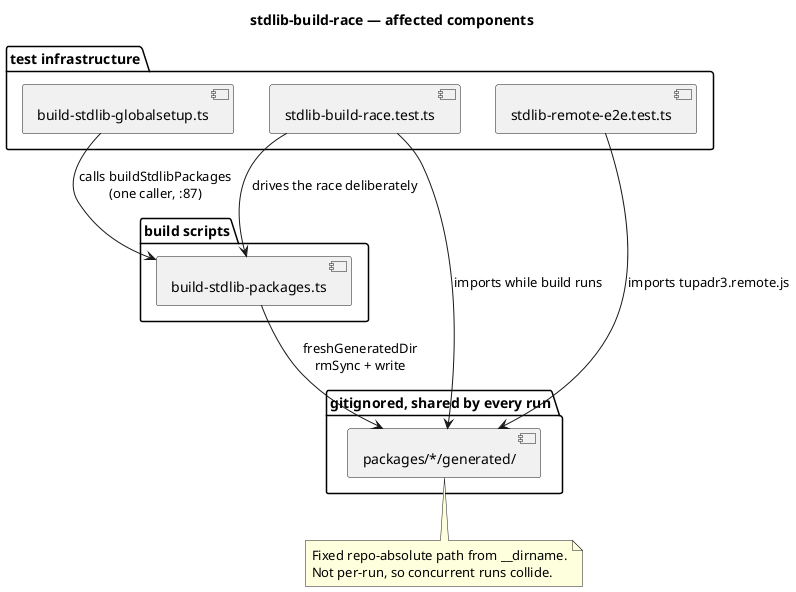

# Component map — what this mission touches

Everything in scope is test and build infrastructure. No `src/` component
appears here, and that is the point: the defect is in how tests prepare their
inputs, not in what the library does.

| Component | Task | Change |
|---|---|---|
| `build-stdlib-packages.ts` | T2, T4 | up-to-date skip, then the lock |
| `build-stdlib-globalsetup.ts` | T3 | doc comment only |
| `stdlib-build-race.test.ts` | T1 | new, env-guarded |
| `stdlib-remote-e2e.test.ts` | — | read-only; the symptom site |
| `src/**` | — | untouched (stop 2) |
