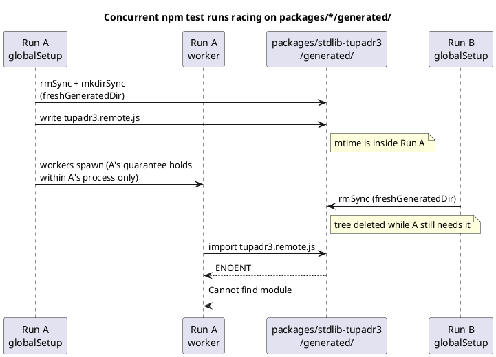
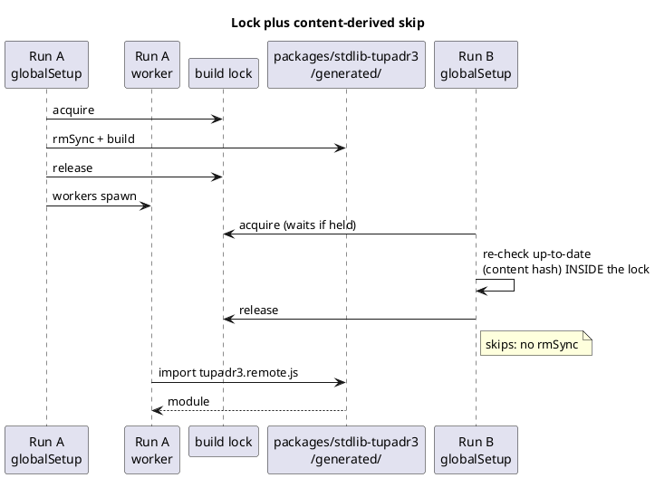

# Data flow — the race, and what closes it

## Today: two concurrent runs share one mutable tree

Run A's `globalSetup` writes the tree, then its workers import out of it. Run
B's `globalSetup` deletes the tree to rebuild it. Nothing coordinates them,
because each run's guarantee is scoped to its own process.

## After the fix: the lock serializes, the predicate makes B a no-op

The second builder waits, re-checks inside the lock, finds the tree complete,
and skips — so no `rmSync` ever runs while another run's workers are reading.

## The residual hole (D3, accepted)

If Run B's inputs genuinely differ, its content hash will not match and it
rebuilds for real — `rmSync` included — while Run A's workers import. The two
runs are then testing different source, which the declined per-run isolated
directory would have separated. Documented, not fixed.
