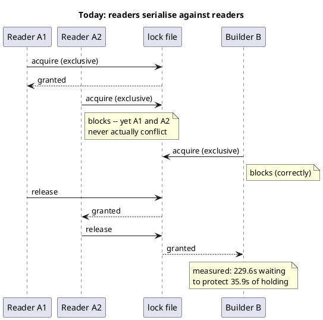
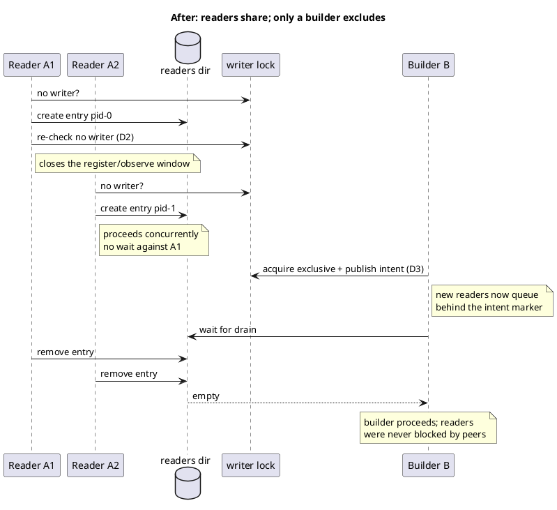

# Lock modes: what changes

Today every acquirer is exclusive, so 573 reader acquisitions across two
concurrent suites queue behind one another for no safety benefit. After this
mission, readers hold concurrently and only a builder excludes them.

Verified to parse through this repo's own `render()` before the mission was
briefed — see the mission's decision journal for the check.

## Today — one mutex, everybody queues

## After — shared readers, exclusive builder, writer priority

## The invariant that must survive

A reader is never mid-read while a builder `rmSync`s
`packages/<pkg>/generated/`. That is exactly what SI35's option D bought, and
this mission must preserve it while removing only the reader-versus-reader
waiting. If a change removes waiting *and* weakens that invariant, it has
missed the point.
