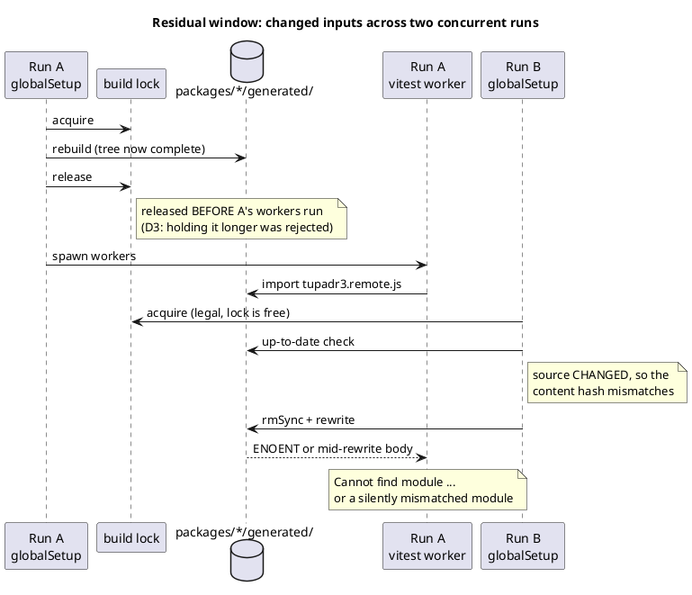

# The residual window

Why the lock cannot close it: it is released when the *build* finishes, but
run A's readers start *after* that. Run B then acquires it legally and, if
the source genuinely changed, rebuilds — deleting the tree under A.

Verified to parse: rendered through this repo's own `render()` (9733-char
SVG, no syntax-error diagram) on 2026-08-21.

**Unchanged inputs take a different path** and are already safe: B's
up-to-date check matches, so B skips and deletes nothing. That is the case
SI34 closed, and the case its committed repro exercises.
