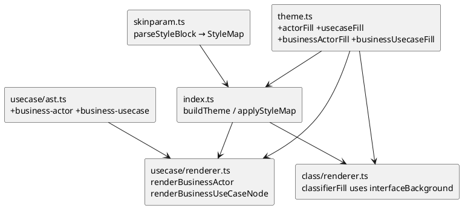

```plantuml
@startuml
skinparam componentStyle rectangle
skinparam shadowing false

[skinparam.ts\nparseStyleBlock → StyleMap] as A
[index.ts\nbuildTheme / applyStyleMap] as D
[theme.ts\n+actorFill +usecaseFill\n+businessActorFill +businessUsecaseFill] as B
[usecase/ast.ts\n+business-actor +business-usecase] as C
[usecase/renderer.ts\nrenderBusinessActor\nrenderBusinessUseCaseNode] as E
[class/renderer.ts\nclassifierFill uses interfaceBackground] as F

A --> D
B --> D
C --> E
B --> E
D --> E
D --> F
B --> F
@enduml
```
