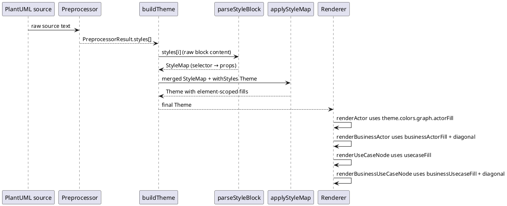

```plantuml
@startuml
participant "PlantUML source" as src
participant "Preprocessor" as pp
participant "buildTheme" as bT
participant "parseStyleBlock" as pSB
participant "applyStyleMap" as aSM
participant "Renderer" as rend
src -> pp : raw source text
pp --> bT : PreprocessorResult.styles[]
bT -> pSB : styles[i] (raw block content)
pSB --> bT : StyleMap (selector → props)
bT -> aSM : merged StyleMap + withStyles Theme
aSM --> bT : Theme with element-scoped fills
bT --> rend : final Theme
rend -> rend : renderActor uses theme.colors.graph.actorFill
rend -> rend : renderBusinessActor uses businessActorFill + diagonal
rend -> rend : renderUseCaseNode uses usecaseFill
rend -> rend : renderBusinessUseCaseNode uses businessUsecaseFill + diagonal
@enduml
```
