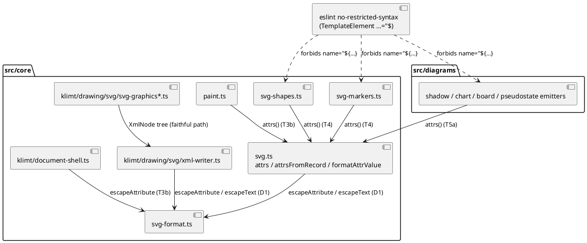

# Component map — two emission paths, one escaper

Touched by this mission: everything except `svg-graphics*.ts` (already on
the faithful path) — it is shown because `xml-writer.ts` is the proof that
the character sets in `svg-format.ts` are the jar's.
