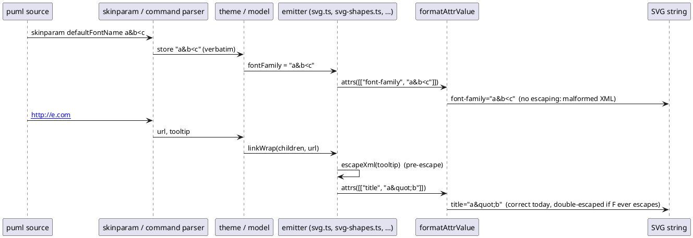
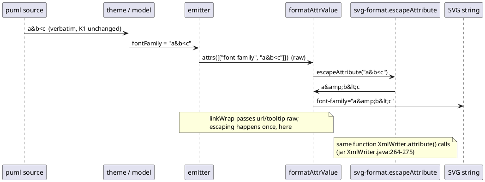

# Data flow — how a user string reaches an attribute

## Before (baseline `0e618b71`)

```plantuml
@startuml
participant "puml source" as S
participant "skinparam / command parser" as P
participant "theme / model" as M
participant "emitter (svg.ts, svg-shapes.ts, …)" as E
participant "formatAttrValue" as F
participant "SVG string" as O
S -> P : skinparam defaultFontName a&b<c
P -> M : store "a&b<c" (verbatim)
M -> E : fontFamily = "a&b<c"
E -> F : attrs([["font-family", "a&b<c"]])
F -> O : font-family="a&b<c"  (no escaping: malformed XML)
S -> P : [[http://e.com{a"b}]]
P -> M : url, tooltip
M -> E : linkWrap(children, url)
E -> E : escapeXml(tooltip)  (pre-escape)
E -> F : attrs([["title", "a&quot;b"]])
F -> O : title="a&quot;b"  (correct today, double-escaped if F ever escapes)
@enduml
```

## After (D1–D3)

```plantuml
@startuml
participant "puml source" as S
participant "theme / model" as M
participant "emitter" as E
participant "formatAttrValue" as F
participant "svg-format.escapeAttribute" as X
participant "SVG string" as O
S -> M : a&b<c  (verbatim, K1 unchanged)
M -> E : fontFamily = "a&b<c"
E -> F : attrs([["font-family", "a&b<c"]])  (raw)
F -> X : escapeAttribute("a&b<c")
X -> F : a&amp;b&lt;c
F -> O : font-family="a&amp;b&lt;c"
note over E, F : linkWrap passes url/tooltip raw;\nescaping happens once, here
note over X : same function XmlWriter.attribute() calls\n(jar XmlWriter.java:264-275)
@enduml
```
