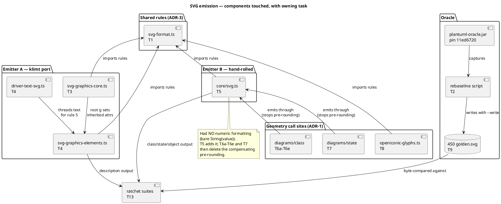

# Component map

Which components this mission touches, and which task owns each. The
central fact: **two emitters**, and the hand-rolled one carries ~394 of
the 445 pinned goldens.

## Golden ownership by emitter

| Emitter | Engines | Pinned goldens |
|---|---|---|
| `core/svg.ts` | class 313, state 58, object 22 | ~394 |
| klimt `svg-graphics-*` | description 51 | 51 |
| (skin) | 1 | 1 |

Porting only the klimt emitter — the shape the mission prompt originally
implied — would leave roughly 88% of the ratchet red.
