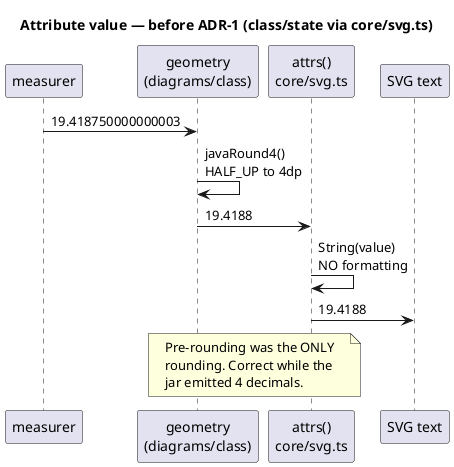
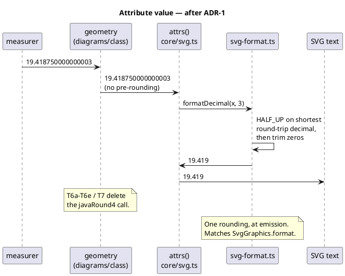
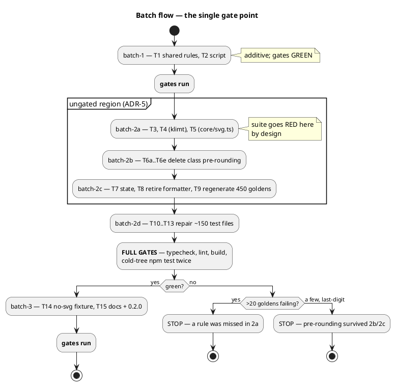

# Data flow — where each rule applies

Two diagrams: where an attribute value acquires its final form (the
double-rounding hazard ADR-1 removes), and how the mission reaches a green
gate.

## Emission path — before and after ADR-1

The defect is that geometry rounds to 4 and emission would then round to 3.
Rounding twice is not rounding once: `1.2345` → 4dp `1.2345` → 3dp `1.235`,
but straight to 3dp is `1.234`.

## Mission flow to a green gate

The ungated region is deliberate (ADR-5): goldens and emitters are only
consistent together, so there is no ordering without a red window.

## Reading the failure signal

| Symptom at batch-2d | Cause | Response |
|---|---|---|
| Hundreds of goldens fail uniformly | A rule missed in batch-2a | Fix the emitter |
| A handful fail on one last digit | Pre-rounding survived batch-2b/2c | Find the call site |
| One emitter's goldens pass, the other's fail | The two emitters diverged | ADR-3 was violated |
| A test asserts the old literal form | Expectation churn | Update it, push forward |
