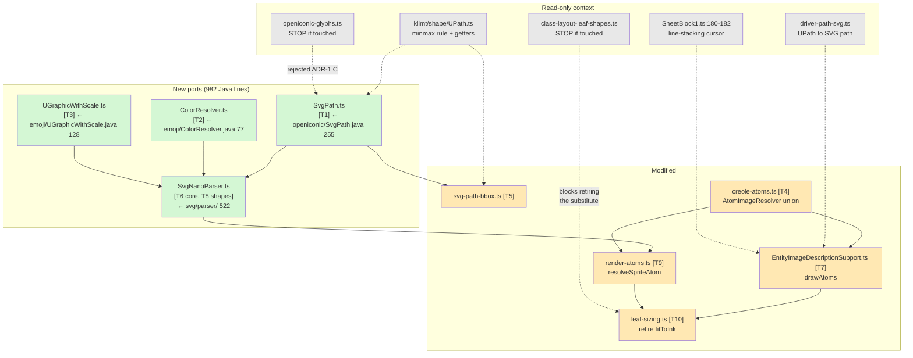
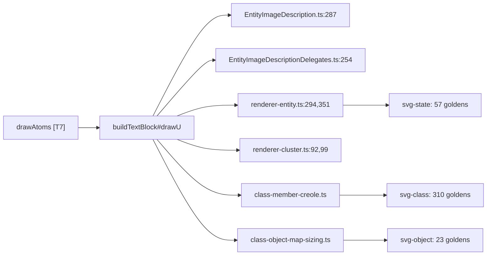

# Component map

Green = created, amber = modified, grey = read-only context.
Task IDs in brackets.

## Blast radius — why 390 goldens guard a description fix

`drawAtoms` is private to `EntityImageDescriptionSupport.ts` and called only
from `buildTextBlock#drawU` — but `buildTextBlock` is the SHARED creole
renderer:

None of those 390 goldens contains a sprite, so they cannot churn — any diff
is collateral damage in the shared renderer. That is why a diff is a STOP
rather than an expected update.
