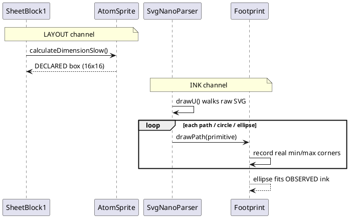
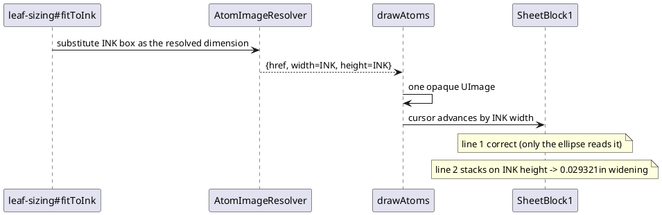
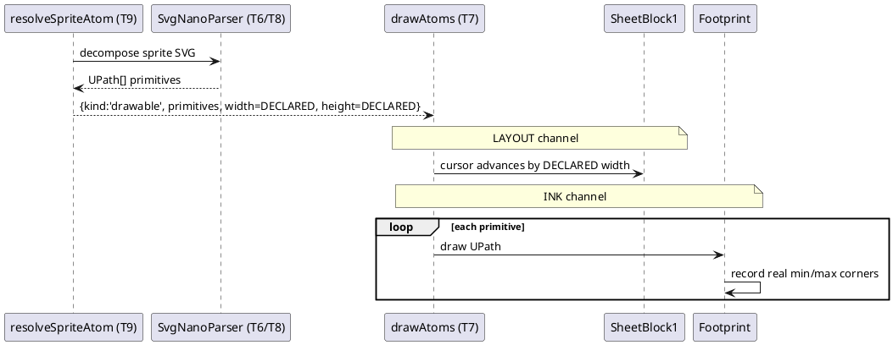

# Data flow — the two channels, before and after

## Upstream (the reference)

Two channels, structurally independent because they are different method
calls on different objects. Nothing computes an "ink box" — the narrowing is
emergent.

## This port, before the mission (the bug)

One channel. `drawAtoms` emits a single opaque `UImage`, so the jar-verified
`svgInkBox` precomputation has nowhere to go but the field `SheetBlock1` also
reads for line stacking.

## This port, after the mission

Two channels again, and structurally unable to recollapse: ink exists only
inside `primitives`, layout only in `width`/`height`.

