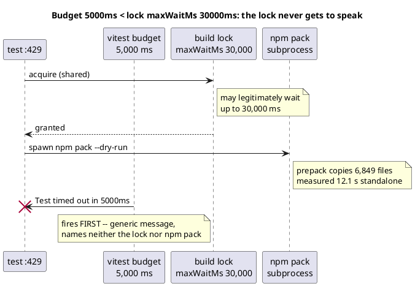
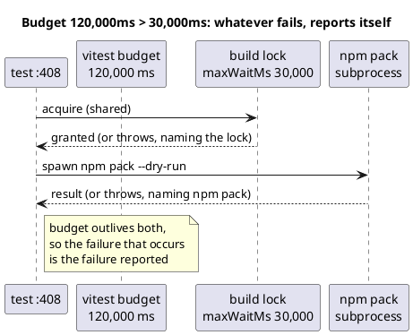

# The budget invariant: why a short timeout hides the real error

A test that acquires the stdlib build lock has two costs inside its own
per-test budget: how long it **waits** for the lock, and how long it **holds**
it. `acquireBuildLock` is willing to wait `DEFAULT_MAX_WAIT_MS` (30,000) before
throwing a message that names the lock. If the test's budget is shorter than
that, the test dies first — and the operator sees a generic timeout instead of
the lock's diagnosis.

Verified to parse through this repo's own `render()` before the mission was
briefed — see the mission's decision journal for the check.

## Today at `stdlib-packages.test.ts:429` — the test dies first



## The sibling at `:408` — budget 120,000 ms, so the real error survives



## The invariant

For every test that acquires the build lock:

```
declared budget > DEFAULT_MAX_WAIT_MS (30,000)
```

Below that line, the lock's designed error is unreachable and every lock
failure is misattributed. D1 makes this a fitness test; D2 requires that test
to see through `npmPackDryRun`-shaped helpers, because `:429` — the defect that
motivated the mission — never names the lock itself.
