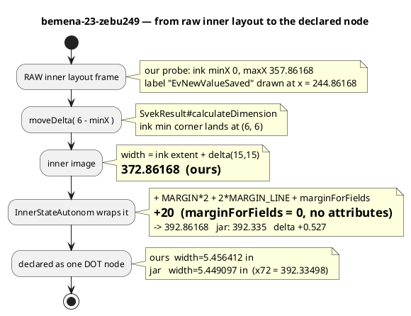
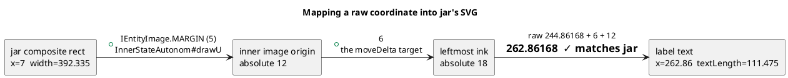

# The coordinate frames

This is where the problem is easiest to get lost: four frames, and the
0.527 only makes sense once you can move between them.



## Absolute placement, and how to check any number against jar's SVG



**The conversion, memorise it:** `absolute = raw + 6 + 12`.

Both directions were confirmed independently — the +5 comes from
`InnerStateAutonom#drawU`'s `UTranslate(IEntityImage.MARGIN, …)`, and jar's
leftmost drawn ink (a transition spline at absolute 18.000) corroborates our
raw `minX = 0`.

## The contradiction, in one line

```
jar DRAWS to   absolute 374.335   (label right edge, measured from its SVG)
jar's width implies  375.335      (392.335 - 15 - 20, then + 6 + 12)
                     --------
                     +1.000       mechanism (B), unidentified
```
