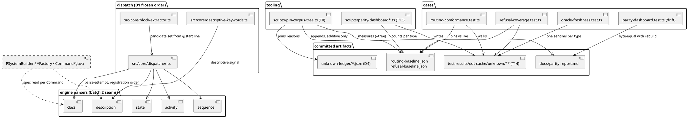

# Component map — what this mission touches

Solid boxes change; dashed boxes are read as the specification.

```plantuml
@startuml
package "dispatch (D1 frozen order)" {
  component [src/core/dispatcher.ts] as Disp
  component [src/core/block-extractor.ts] as BE
  component [src/core/descriptive-keywords.ts] as DK
}
package "engine parsers (batch 2 seams)" {
  component [class] as Cls
  component [description] as Desc
  component [state] as St
  component [activity] as Act
  component [sequence] as Seq
}
package "tooling" {
  component [scripts/pin-corpus-tree.ts (T0)] as Gen
  component [scripts/parity-dashboard*.ts (T13)] as Dash
}
package "committed artifacts" {
  component [unknown-ledger/*.json (D4)] as Ledger
  component [routing-baseline.json\nrefusal-baseline.json] as Base
  component [test-results/dot-cache/unknown/** (T14)] as Tree
  component [docs/parity-report.md] as Report
}
package "gates" {
  component [routing-conformance.test.ts] as RG
  component [refusal-coverage.test.ts] as FG
  component [oracle-freshness.test.ts] as OF
  component [parity-dashboard.test.ts (drift)] as DG
}
component "PSystemBuilder / *Factory / Command*.java" as Java #line.dashed

Disp --> Cls : parse-attempt, registration order
Disp --> Desc
Disp --> St
Disp --> Act
Disp --> Seq
BE --> Disp : candidate set from @start line
DK --> Desc : descriptive signal
Java ..> Cls : spec read per Command
Java ..> Desc
Gen --> Tree : measures (--tree)
Gen --> Ledger : joins reasons
Gen --> Base : appends, additive only
RG --> Base : pins vs live
FG --> Base
RG --> Tree : walks
FG --> Tree
OF --> Tree : one sentinel per type
Dash --> Base : counts per type
Dash --> Report : writes
DG --> Report : byte-equal with rebuild
@enduml
```
