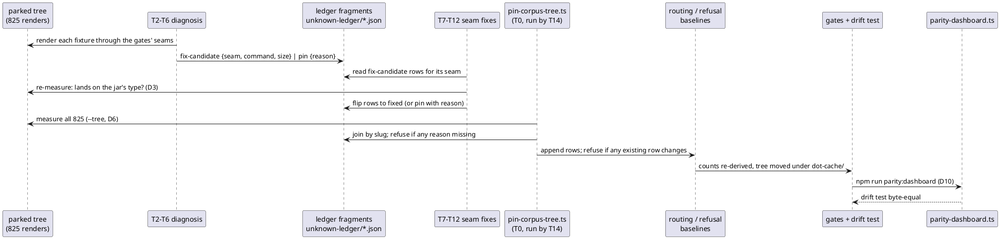

# Data flow — from parked renders to green gates

Who produces what, in what order. The renders exist before the mission
starts; nothing here invokes the jar except a single diagnostic probe.

```plantuml
@startuml
participant "parked tree\n(825 renders)" as Tree
participant "T2–T6 diagnosis" as Diag
participant "ledger fragments\nunknown-ledger/*.json" as Ledger
participant "T7–T12 seam fixes" as Fix
participant "pin-corpus-tree.ts\n(T0, run by T14)" as Gen
participant "routing / refusal\nbaselines" as Base
participant "gates + drift test" as Gates
participant "parity-dashboard.ts" as Dash

Diag -> Tree : render each fixture through the gates' seams
Diag -> Ledger : fix-candidate {seam, command, size} | pin {reason}
Fix -> Ledger : read fix-candidate rows for its seam
Fix -> Tree : re-measure: lands on the jar's type? (D3)
Fix -> Ledger : flip rows to fixed (or pin with reason)
Gen -> Tree : measure all 825 (--tree, D6)
Gen -> Ledger : join by slug; refuse if any reason missing
Gen -> Base : append rows; refuse if any existing row changes
Base -> Gates : counts re-derived, tree moved under dot-cache/
Gates -> Dash : npm run parity:dashboard (D10)
Dash --> Gates : drift test byte-equal
@enduml
```
