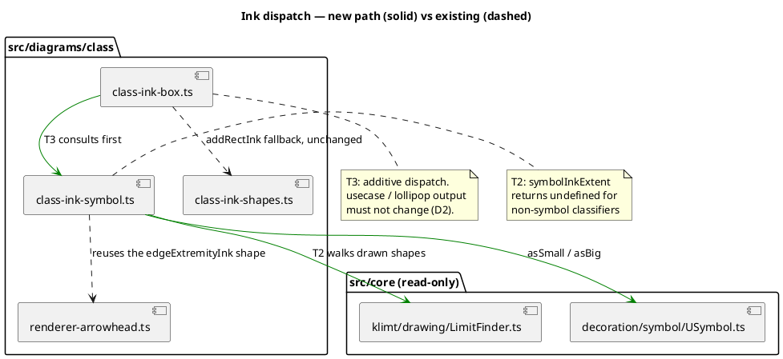

# What this mission touches

## Ownership

| File | Owner | Batch |
|---|---|---|
| `.agent-notes/usymbol-ink-family.md` | T1, then T4 | 1, 2 |
| `src/diagrams/class/class-ink-symbol.ts` | T2 | 1 |
| `src/diagrams/class/class-ink-box.ts` | T3 | 2 |

No two tasks in a batch share a file.
